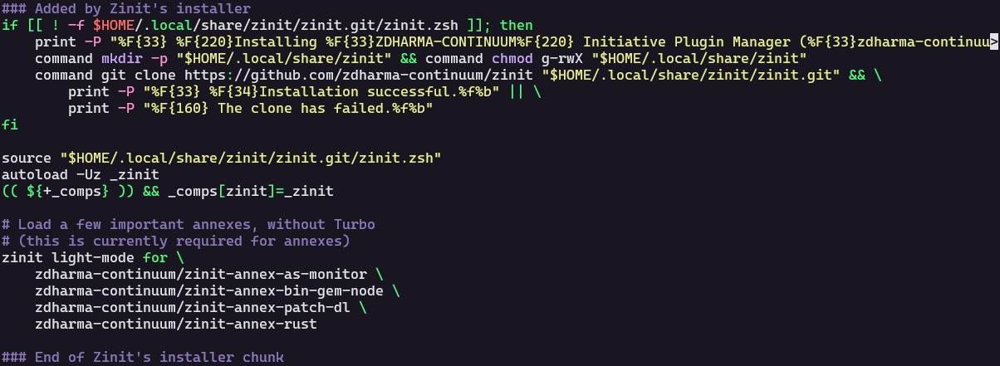

# *Zinit: Gerenciador de Plugins para Zsh*

### 1 - *O que é Zinit?*
---
- O Zinit é um gerenciador de plugins e flexível para o shell Zsh. 
Ele permite que você *gerencie plugins, temas e scripts de forma eficiente, carregando-os rapidamente e otimizando a inicialização do terminal*. Com o Zinit, você pode personalizar e expandir as funcionalidades do Zsh de forma prática e organizada.

### 1.1 - *Caractériscas Principais:*
---

- Carregamento assíncrono: Plugins são carregados em paralelo, melhorando o tempo de inicialização.

- Cache de plugins: Armazena os plugins já carregados, evitando downloads desnecessários.

- Suporte a plugins em diversas fontes: Você pode instalar plugins diretamente do GitHub, GitLab, Bitbucket, entre outros repositórios.

- Integração com outros gerenciadores de plugins: Zinit pode trabalhar com outros gerenciadores como o zplug, zgen, entre outros.

### 1.2 - *Como instalar o Zinit?*
---
- Instalar via terminal: Cole esse comando no seu terminal para fazer a instalação do Zinit

        bash -c "$(curl -fsSL https://git.io/zinit-install)"

---

### 2 - *Adionando Plugins*
---

Após instalar o Zinit, abra as configurações do ZSH com o seguinte comando:
        
        nano ~/.zshrc

---
Caso esteja em duvida se instalou o zinit, digite o comando para analisar todos os seus arquivos inclundo os ocultos com detalhes sobre cada um, verifique se contém o item zenit:

        ls -la

---
Procure por esse bloco nas configurações do zshrc:

Se consegue visualizar esse bloco de código, siginica que deu certo a instalação. Após a frase "End of Zinit's installer chunk" é onde irá adicionar seus pluggins.

---

### 2.1 - *Plugins*
Ao fazer tudo isso, pode copiar e colar esses Plugins em baixo do lugar falado:

    zinit light zdharma/fast-syntax-highlighting

- Esse plugin destaca a sintaxe dos comandos digitados no terminal Zsh em tempo real. Por exemplo:
Comandos válidos são exibidos em cores diferentes.
Erros de sintaxe ou comandos inválidos aparecem destacados.

        zinit light zsh-users/zsh-autosuggestions

- O que faz: Fornece sugestões automáticas enquanto você digita no terminal, baseando-se no histórico de comandos ou em comandos populares.
Por exemplo, ao começar a digitar git che, ele pode sugerir git checkout.

        zinit light zsh-users/zsh-completions

- O que faz: Melhora as completions (autocompletar) do Zsh, adicionando suporte a muitos comandos, opções e ferramentas adicionais. Ele cobre uma ampla variedade de programas e linguagens, como:
git, docker, kubectl, entre outros.

---

### 3.0 - Finalização

Para salvar suas alterações, ainda dentro das configurações do ZSHRC, clique *Ctrl* + *S* (Para salvar) e depois *Ctrl* + *X* (Para sair).

No terminal, digite o seguinte comando:

        source ~/.zshrc

Esse comando vai atualizar e compilar suas alterações.

